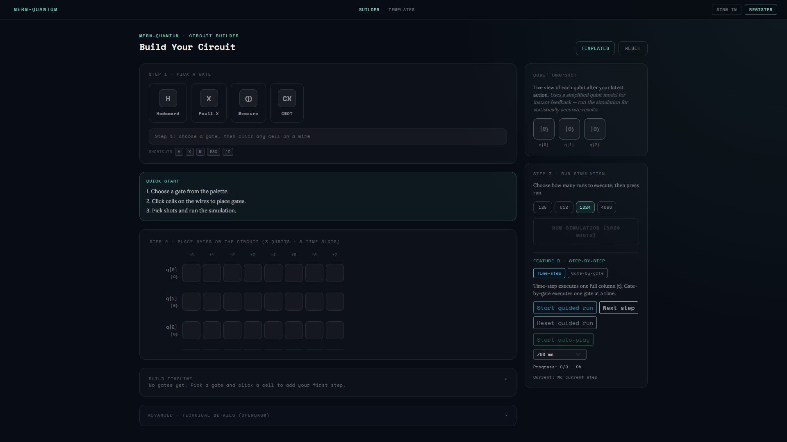
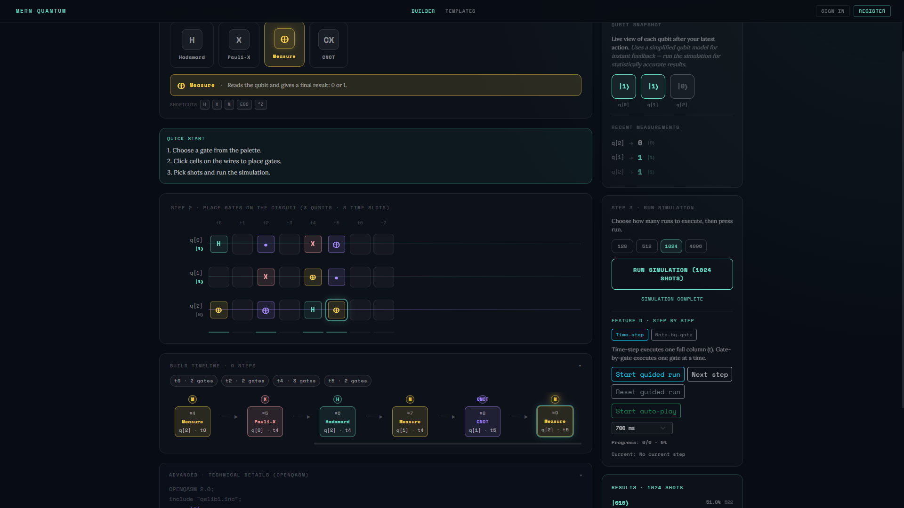
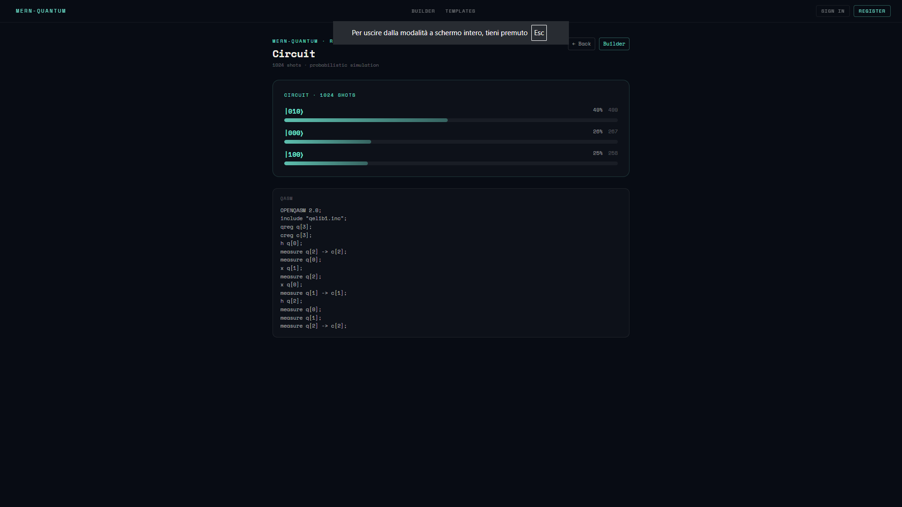
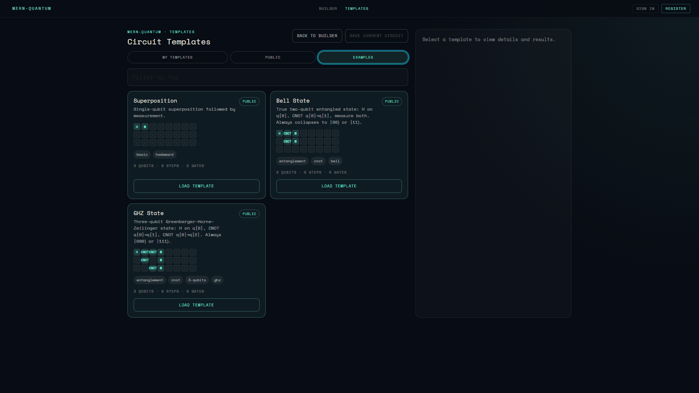
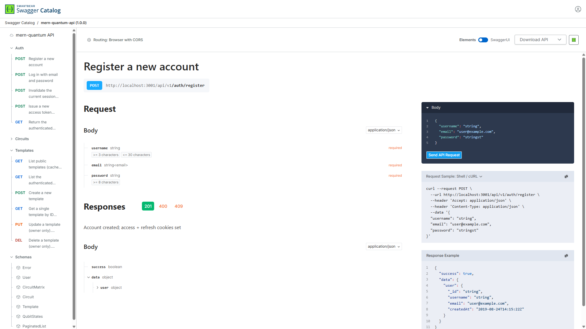

<div align="center">

# ⚛ mern-quantum

**Interactive Quantum Circuit Simulator — Full-Stack Capstone Project**

[](./backend)
[](./frontend)
[](./e2e)
[](https://nodejs.org)
[](https://react.dev)
[](https://expressjs.com)
[](https://mongoosejs.com)
[](./LICENSE)
[](http://localhost:3001/api/v1/docs)

> Build, simulate, and share quantum circuits in the browser.  
> Educational step-by-step mode · Statevector simulation · Community templates · JWT auth · Docker-ready.

</div>

---

## 🇬🇧 English

### Table of Contents

1. [Project Overview](#-project-overview)
2. [Screenshots](#-screenshots)
3. [Features](#-features)
4. [Architecture](#-architecture)
5. [Tech Stack](#-tech-stack)
6. [Security](#-security)
7. [Quantum Physics Models](#-quantum-physics-models)
8. [Setup & Run](#-setup--run)
9. [Environment Variables](#-environment-variables)
10. [Testing](#-testing)
11. [API Reference](#-api-reference)
12. [Docker](#-docker)
13. [Project Structure](#-project-structure)

---

### 🎯 Project Overview

**mern-quantum** is a production-grade full-stack web application that lets users design, simulate, and share quantum circuits directly in the browser. It was built as a Capstone project demonstrating advanced software engineering skills across the entire stack: secure REST API design, statevector quantum simulation, feature-first React architecture, and a comprehensive automated test suite.

The application is designed with two complementary goals:

- **Pedagogical**: step-by-step gate execution with a simplified qubit model gives learners immediate, human-readable feedback (`|0⟩`, `|1⟩`, `|+⟩`) after every action.
- **Accurate**: the multi-shot "Run Simulation" feature uses a real complex-amplitude statevector simulation (`Float64Array`) with correct entanglement and measurement collapse.

---

### 📸 Screenshots

| Circuit Builder | Step-by-Step Mode | Simulation Results |
|---|---|---|
|  |  |  |

| Templates Gallery | Swagger UI |
|---|---|
|  |  |

---

### ✨ Features

| Feature | Description |
|---|---|
| **Circuit Canvas** | Interactive drag-free gate placement on a qubit/time-step grid |
| **Gate Library** | H (Hadamard), X (Pauli-NOT), M (Measurement), CNOT (entanglement) |
| **Step-by-Step Mode** | Gate-by-gate or time-step-by-time-step execution with live qubit state panel |
| **Auto-Play** | Configurable interval auto-advancement through the step queue |
| **Multi-Shot Simulation** | Statevector simulation with configurable shots (preset: 128 / 512 / 1024) |
| **Results Histogram** | Probability distribution bar chart + outcome count table |
| **QASM Preview** | Real-time OpenQASM 2.0 export of the current circuit |
| **Templates** | Create, browse (public / mine), preview, edit, and delete community circuits |
| **Authentication** | Register / login / logout / token refresh with HttpOnly JWT cookies |
| **Undo Stack** | Single-gesture undo (Ctrl+Z / Cmd+Z) for gate placement |
| **Keyboard Shortcuts** | Gate selection via keyboard, undo, deselect |
| **Save & Dashboard** | Named circuit persistence; per-user circuit list with pagination |
| **Confirm Dialogs** | Accessible `<ConfirmModal>` replaces all `window.confirm` calls |
| **Swagger UI** | Interactive API explorer at `/api/v1/docs` |
| **Docker** | Multi-stage Dockerfile + nginx reverse proxy + docker-compose |

---

### 🏗 Architecture

```
mern-quantum/
├── backend/                  Express API (Node.js ESM)
│   ├── controllers/          Route handlers (auth, circuit, template)
│   ├── services/             Business logic (quantum simulation)
│   ├── models/               Mongoose schemas (User, Circuit, Template)
│   ├── routes/               Express routers
│   ├── middleware/           Auth guard (LRU cache), rate limit, Zod validation
│   ├── validators/           Zod schemas for all request bodies
│   ├── config/               DB connection, Sentry
│   ├── utils/                Logger (Pino), respond helpers
│   ├── openapi.json          OpenAPI 3.1 spec
│   └── server.e2e.js         E2E backend entry (MongoMemoryServer)
│
├── frontend/                 React 19 SPA (Vite)
│   └── src/
│       ├── features/         Feature-first modules
│       │   ├── circuit-builder/   Circuit canvas, hooks, gate logic
│       │   ├── multi-run/         Multi-shot simulation feature
│       │   ├── step-by-step/      Step-by-step execution + handlers
│       │   └── templates/         Template CRUD + preview
│       ├── pages/            Route-level components
│       ├── components/       Shared UI (ConfirmModal)
│       ├── api/              Axios client + error normalization
│       ├── context/          AuthContext (JWT cookie session)
│       └── hooks/            useAuth
│
├── e2e/                      Playwright E2E tests
│   ├── auth.real.e2e.js      Real backend tests (no mocks)
│   ├── auth.e2e.js           Mocked UI tests
│   ├── circuit-builder.e2e.js
│   ├── templates.e2e.js
│   └── full-workflow.e2e.js
│
└── docs/
    ├── ui-sketch.html        Interactive UI wireframe with API map
    └── screenshots/          (add your screenshots here)
```

**Data flow:**

```
Browser → nginx (:80) → /api/* → Express (:3001) → MongoDB
                      → /*     → React SPA (static)
```

---

### 🔧 Tech Stack

#### Backend

| Technology | Version | Role |
|---|---|---|
| Node.js | 22+ | Runtime |
| Express | 5 | HTTP framework |
| Mongoose | 9 | ODM for MongoDB |
| JSON Web Token | 9 | Access + refresh token auth |
| bcrypt | 6 | Password hashing (cost factor 10) |
| Zod | 4 | Runtime schema validation |
| Helmet | 8.1 | HTTP security headers + CSP |
| express-rate-limit | 8 | Per-user + per-IP rate limiting |
| Pino | 10 | Structured JSON logging |
| @sentry/node | 10 | Error tracking |
| mongodb-memory-server | 11 | In-memory DB for tests |

#### Frontend

| Technology | Version | Role |
|---|---|---|
| React | 19 | UI library |
| Vite | 8 | Build tool + dev server |
| React Router | 7 | Client-side routing |
| React Bootstrap | 2 | Component library |
| Axios | 1 | HTTP client |
| @sentry/react | 10 | Frontend error tracking |
| web-vitals | 5 | Core Web Vitals monitoring |

#### Testing & Quality

| Tool | Scope |
|---|---|
| Vitest + Supertest | Backend unit + integration (77 tests) |
| Vitest + @testing-library/react | Frontend unit + hooks (55 tests) |
| Playwright | E2E cross-browser (Chrome, Firefox, Safari) |
| ESLint | Linting with react-hooks + react-refresh plugins |
| Husky + lint-staged | Pre-commit ESLint enforcement |

---

### 🔒 Security

The application addresses the relevant OWASP Top 10 categories:

| Threat | Mitigation |
|---|---|
| **Broken Authentication** | HttpOnly JWT cookies (no localStorage), 15 min access token, 30-day refresh token rotation |
| **Injection** | Zod schema validation on all inputs; Mongoose parameterized queries |
| **Broken Access Control** | `protect` middleware on every mutating route; owner checks before update/delete |
| **Security Misconfiguration** | Helmet CSP, `X-Frame-Options`, `X-Content-Type-Options`; `trust proxy 1` for correct IP behind nginx |
| **Rate Limiting** | Auth limiter (20 req/15 min per IP); simulation limiter (30 req/min per user or IP) |
| **Sensitive Data Exposure** | `password` field excluded from all API responses; bcrypt cost 10 |
| **CORS** | Explicit allowlist via `CORS_ORIGIN` env var; `credentials: true` |
| **Password Policy** | Minimum 8 characters, at least one uppercase, one lowercase, one digit — validated both client-side and server-side (Zod regex) |
| **Auth Cache** | LRU token verification cache (TTL 60 s, max 500 entries) to reduce DB load without stale-token risk |

---

### ⚛ Quantum Physics Models

The application intentionally implements **two distinct physics models** serving different educational purposes:

#### 1. Pedagogical Model — `applyGateStep()` (step-by-step feature)

Represents each qubit as `{ value: 0|1, superposition: boolean }`. Gives learners immediate, human-readable feedback (`|0⟩`, `|1⟩`, `|+⟩`) after every gate.

Known approximations (by design):
- H applied twice returns to the original deterministic state ✓
- X on a superposition leaves distribution unchanged (simplification: real X maps `|+⟩ → |+⟩` with phase change)
- CNOT with a superposed control collapses it before entangling (avoids multi-qubit entanglement in the simplified model)

#### 2. Statevector Model — `simulate()` (run simulation feature)

Uses `Float64Array` of length `2 × 2ⁿ` storing `[re₀, im₀, re₁, im₁, …]`. Implements correct unitary gate application and measurement collapse. Produces accurate probability distributions for multi-shot runs.

Gates implemented: H (Hadamard), X (Pauli-X), M (projective measurement with Born-rule collapse), CNOT (two-qubit controlled-NOT with full entanglement).

> The UI notes this distinction in the Live State Panel: _"Uses a simplified qubit model for instant feedback — run the simulation for statistically accurate results."_

---

### 🚀 Setup & Run

#### Prerequisites

- Node.js ≥ 22
- npm ≥ 10
- MongoDB (local or Atlas) — **only needed for production/dev**; tests use `mongodb-memory-server`

#### 1. Clone and install

```bash
git clone https://github.com/mattiagiuliani/mern-quantum.git
cd mern-quantum
npm install
```

#### 2. Configure environment variables

Create `backend/.env`:

```env
MONGODB_URI=mongodb://localhost:27017/mern-quantum
JWT_SECRET=replace-with-32-char-random-string
JWT_REFRESH_SECRET=replace-with-another-32-char-string
JWT_EXPIRES_IN=15m
JWT_REFRESH_EXPIRES_IN=30d
CORS_ORIGIN=http://localhost:5173
PORT=3001
```

Create `frontend/.env.local`:

```env
VITE_API_URL=http://localhost:3001/api/v1
```

#### 3. Run in development

```bash
# Terminal 1 — backend
npm run dev:backend

# Terminal 2 — frontend
npm run dev:frontend
```

Open **http://localhost:5173**

#### 4. API Explorer (Swagger UI)

With the backend running, open **http://localhost:3001/api/v1/docs**

---

### 🌍 Environment Variables

| Variable | Required | Default | Description |
|---|---|---|---|
| `MONGODB_URI` | ✅ | — | MongoDB connection string |
| `JWT_SECRET` | ✅ | — | HMAC secret for access tokens |
| `JWT_REFRESH_SECRET` | ✅ | — | HMAC secret for refresh tokens |
| `JWT_EXPIRES_IN` | ❌ | `15m` | Access token TTL |
| `JWT_REFRESH_EXPIRES_IN` | ❌ | `30d` | Refresh token TTL |
| `CORS_ORIGIN` | ✅ | — | Comma-separated allowed origins |
| `PORT` | ❌ | `3001` | Backend listening port |
| `VITE_API_URL` | ✅ (frontend) | — | Backend base URL for Axios |

---

### 🧪 Testing

#### Unit + Integration

```bash
# Backend — 77 tests (controllers, services, routes, middleware)
npm run test:backend

# Frontend — 55 tests (hooks, utils, components)
npm run test:frontend

# Both
npm test
```

Backend tests use `mongodb-memory-server` — no external database required.

#### End-to-End (Playwright)

```bash
# All browsers (Chrome, Firefox, Safari)
npm run test:e2e

# Interactive UI mode
npm run test:e2e:ui

# Debug mode
npm run test:e2e:debug

# Only real backend tests (no mocks)
npx playwright test auth.real.e2e.js --project=chromium
```

Playwright automatically starts:
- The frontend dev server on port 5173
- A real Express backend with `MongoMemoryServer` on port 3001

The `auth.real.e2e.js` suite runs **without any `page.route()` mocks** — it exercises the full stack: React → Axios → Express → Mongoose → MongoMemoryServer.

#### Test Coverage Summary

| Suite | Tests | What is covered |
|---|---|---|
| Backend unit (controllers, services) | 35 | Auth flow, quantum gates, template CRUD |
| Backend integration (routes) | 42 | Full HTTP request/response cycle |
| Frontend unit (hooks, utils) | 55 | Gate logic, multi-run utils, hook behavior |
| E2E mocked | 20+ | UI interactions, navigation, state transitions |
| E2E real (no mocks) | 3 | Register, login error, login success |

---

### 📡 API Reference

Base URL: `http://localhost:3001/api/v1`

Interactive docs: **http://localhost:3001/api/v1/docs** (Swagger UI)  
Machine-readable spec: **http://localhost:3001/api/v1/openapi.json** (OpenAPI 3.1)

#### Auth endpoints

| Method | Path | Auth | Description |
|---|---|---|---|
| `POST` | `/auth/register` | — | Create account, set auth cookies |
| `POST` | `/auth/login` | — | Authenticate, set auth cookies |
| `POST` | `/auth/logout` | — | Clear cookies |
| `POST` | `/auth/refresh` | — | Rotate access token using refresh cookie |
| `GET` | `/auth/me` | 🔒 | Return current user profile |

#### Circuit endpoints

| Method | Path | Auth | Description |
|---|---|---|---|
| `POST` | `/circuits/run` | — | Statevector simulation (shots-based) |
| `POST` | `/circuits/applyGate` | — | Pedagogical single-gate application |
| `POST` | `/circuits` | 🔒 | Save new circuit |
| `GET` | `/circuits/mine` | 🔒 | List own circuits (paginated) |
| `GET` | `/circuits/:id` | 🔒 | Get circuit by ID |
| `PUT` | `/circuits/:id` | 🔒 | Update circuit |
| `DELETE` | `/circuits/:id` | 🔒 | Delete circuit |

#### Template endpoints

| Method | Path | Auth | Description |
|---|---|---|---|
| `GET` | `/templates/public` | — | List public templates (paginated, filterable by tag) |
| `GET` | `/templates/mine` | 🔒 | List own templates |
| `GET` | `/templates/:id` | — | Get template (private = owner only) |
| `POST` | `/templates` | 🔒 | Create template |
| `PUT` | `/templates/:id` | 🔒 | Update own template |
| `DELETE` | `/templates/:id` | 🔒 | Delete own template |

Response contract:

```json
{ "success": true, "data": { ... } }
{ "success": false, "message": "Human-readable error" }
```

---

### 🐳 Docker

```bash
# Build and start all services
docker compose up --build

# Stop
docker compose down
```

The stack:
- **backend** container: Node.js API on port 3001
- **frontend** container: nginx on port 80, proxies `/api/` to backend

nginx also serves the React SPA with SPA fallback (`try_files $uri /index.html`) and adds `Strict-Transport-Security` headers.

---

### 📁 Project Structure (detailed)

```
mern-quantum/
├── backend/
│   ├── app.js                    Express factory (CSP, CORS, routes, Swagger)
│   ├── server.js                 Production entry point
│   ├── server.e2e.js             E2E entry (MongoMemoryServer)
│   ├── openapi.json              OpenAPI 3.1 specification
│   ├── config/
│   │   ├── db.js                 connectDB()
│   │   └── sentry.js             Sentry init
│   ├── controllers/
│   │   ├── auth.controller.js    register / login / logout / refresh / me
│   │   ├── circuit.controller.js run / applyGate / CRUD
│   │   └── template.controller.js CRUD + public listing
│   ├── middleware/
│   │   ├── auth.middleware.js    JWT verify + LRU cache
│   │   ├── perf.js               Request timing logger
│   │   └── validate.js           Zod middleware factory
│   ├── models/
│   │   ├── User.model.js         username, email, password (hashed)
│   │   ├── Circuit.model.js      owner, name, matrix, lastResult
│   │   └── Template.model.js     name, tags, circuit, isPublic, author
│   ├── routes/
│   │   ├── auth.routes.js
│   │   ├── circuit.routes.js
│   │   └── template.routes.js
│   ├── services/
│   │   └── quantum.service.js    applyGateStep() + simulate() (statevector)
│   ├── validators/
│   │   ├── auth.schemas.js       emailSchema, passwordSchema (min 8 + regex)
│   │   ├── circuit.schemas.js
│   │   └── template.schemas.js
│   └── utils/
│       ├── logger.js             Pino instance
│       ├── respond.js            ok() / fail() helpers
│       └── circuitValidation.js
│
├── frontend/src/
│   ├── App.jsx                   Router + AuthContext provider
│   ├── api/
│   │   ├── apiClient.js          Axios instance + interceptors
│   │   └── apiError.js           Error normalization
│   ├── components/
│   │   └── ConfirmModal.jsx      Accessible confirm dialog
│   ├── context/
│   │   └── AuthContext.jsx       Session state + login/register/logout
│   ├── features/
│   │   ├── circuit-builder/      Canvas, hooks, palette, QASM, live state
│   │   ├── multi-run/            Shot presets, run orchestration, histogram
│   │   ├── step-by-step/         Queue, status FSM, useStepByStepHandlers
│   │   └── templates/            Template list, preview, save modal
│   ├── pages/
│   │   ├── CircuitBuilderPage.jsx
│   │   ├── TemplatesPage.jsx
│   │   ├── DashboardPage.jsx
│   │   ├── ResultsPage.jsx
│   │   ├── LoginPage.jsx
│   │   ├── RegisterPage.jsx
│   │   └── Homepage.jsx
│   └── hooks/
│       └── useAuth.js
│
├── e2e/
│   ├── auth.real.e2e.js          Real stack E2E (no mocks)
│   ├── auth.e2e.js
│   ├── circuit-builder.e2e.js
│   ├── templates.e2e.js
│   └── full-workflow.e2e.js
│
├── docs/
│   ├── ui-sketch.html            Interactive wireframe + API map
│   └── screenshots/              (place screenshots here)
│
├── playwright.config.js          Two webServers: frontend + e2e backend
├── docker-compose.yml
└── package.json                  npm workspaces root
```

---

## 🇮🇹 Italiano

### Indice

1. [Panoramica del progetto](#-panoramica-del-progetto)
2. [Screenshot](#-screenshot-1)
3. [Funzionalità](#-funzionalità)
4. [Architettura](#-architettura-1)
5. [Stack tecnologico](#-stack-tecnologico)
6. [Sicurezza](#-sicurezza)
7. [Modelli fisici quantistici](#-modelli-fisici-quantistici)
8. [Installazione ed esecuzione](#-installazione-ed-esecuzione)
9. [Variabili d'ambiente](#-variabili-dambiente)
10. [Testing](#-testing-1)
11. [Riferimento API](#-riferimento-api)
12. [Docker](#-docker-1)

---

### 🎯 Panoramica del progetto

**mern-quantum** è un'applicazione web full-stack production-grade che permette agli utenti di progettare, simulare e condividere circuiti quantistici direttamente nel browser. È stata sviluppata come progetto Capstone per dimostrare competenze avanzate di ingegneria del software sull'intero stack: progettazione di API REST sicure, simulazione quantistica statevector, architettura React feature-first e una suite completa di test automatizzati.

L'applicazione è progettata con due obiettivi complementari:

- **Pedagogico**: l'esecuzione gate-by-gate con modello qubit semplificato fornisce agli studenti feedback immediato e leggibile (`|0⟩`, `|1⟩`, `|+⟩`) dopo ogni azione.
- **Accurato**: la funzione "Run Simulation" multi-shot usa una vera simulazione statevector ad ampiezza complessa (`Float64Array`) con entanglement corretto e collasso della misurazione.

---

### 📸 Screenshots

| Circuit Builder | Step-by-Step Mode | Simulation Results |
|---|---|---|
|  |  |  |

| Templates Gallery | Swagger UI |
|---|---|
|  |  |

---

### ✨ Funzionalità

| Funzionalità | Descrizione |
|---|---|
| **Canvas del circuito** | Posizionamento gate interattivo su griglia qubit/passo temporale |
| **Libreria gate** | H (Hadamard), X (Pauli-NOT), M (Misurazione), CNOT (entanglement) |
| **Modalità step-by-step** | Esecuzione gate per gate o passo per passo con pannello qubit live |
| **Auto-play** | Avanzamento automatico con intervallo configurabile |
| **Simulazione multi-shot** | Simulazione statevector con shot configurabili (128 / 512 / 1024) |
| **Istogramma risultati** | Grafico a barre distribuzione probabilità + tabella conteggi |
| **Preview QASM** | Esportazione OpenQASM 2.0 in tempo reale del circuito corrente |
| **Template** | Crea, sfoglia (pubblici / miei), anteprima, modifica ed elimina circuiti |
| **Autenticazione** | Registrazione / login / logout / refresh token con cookie JWT HttpOnly |
| **Stack undo** | Undo con un gesto (Ctrl+Z / Cmd+Z) per il posizionamento dei gate |
| **Shortcut da tastiera** | Selezione gate da tastiera, undo, deseleziona |
| **Salvataggio e Dashboard** | Persistenza circuiti con nome; lista circuiti per utente con paginazione |
| **Dialog di conferma** | `<ConfirmModal>` accessibile sostituisce tutte le chiamate a `window.confirm` |
| **Swagger UI** | Explorer API interattivo su `/api/v1/docs` |
| **Docker** | Dockerfile multi-stage + reverse proxy nginx + docker-compose |

---

### 🏗 Architettura

La struttura è identica a quella descritta nella sezione inglese. Flusso dati:

```
Browser → nginx (:80) → /api/* → Express (:3001) → MongoDB
                      → /*     → React SPA (static)
```

---

### 🔧 Stack tecnologico

#### Backend

| Tecnologia | Versione | Ruolo |
|---|---|---|
| Node.js | 22+ | Runtime |
| Express | 5 | Framework HTTP |
| Mongoose | 9 | ODM per MongoDB |
| JSON Web Token | 9 | Auth token accesso + refresh |
| bcrypt | 6 | Hash password (cost factor 10) |
| Zod | 4 | Validazione schema runtime |
| Helmet | 8.1 | Header di sicurezza HTTP + CSP |
| express-rate-limit | 8 | Rate limiting per utente e per IP |
| Pino | 10 | Logging strutturato JSON |
| @sentry/node | 10 | Tracciamento errori |
| mongodb-memory-server | 11 | DB in-memory per i test |

#### Frontend

| Tecnologia | Versione | Ruolo |
|---|---|---|
| React | 19 | Libreria UI |
| Vite | 8 | Build tool + dev server |
| React Router | 7 | Routing client-side |
| React Bootstrap | 2 | Libreria di componenti |
| Axios | 1 | Client HTTP |
| @sentry/react | 10 | Tracciamento errori frontend |
| web-vitals | 5 | Monitoraggio Core Web Vitals |

#### Testing e qualità

| Strumento | Scope |
|---|---|
| Vitest + Supertest | Backend unit + integration (77 test) |
| Vitest + @testing-library/react | Frontend unit + hooks (55 test) |
| Playwright | E2E cross-browser (Chrome, Firefox, Safari) |
| ESLint | Linting con plugin react-hooks + react-refresh |
| Husky + lint-staged | ESLint pre-commit automatico |

---

### 🔒 Sicurezza

L'applicazione affronta le categorie rilevanti dell'OWASP Top 10:

| Minaccia | Mitigazione |
|---|---|
| **Broken Authentication** | Cookie JWT HttpOnly (no localStorage), access token 15 min, rotation refresh token 30 giorni |
| **Injection** | Validazione schema Zod su tutti gli input; query parametrizzate Mongoose |
| **Broken Access Control** | Middleware `protect` su ogni route che muta dati; controllo proprietario prima di update/delete |
| **Security Misconfiguration** | Helmet CSP, `X-Frame-Options`, `X-Content-Type-Options`; `trust proxy 1` per IP corretto dietro nginx |
| **Rate Limiting** | Auth limiter (20 req/15 min per IP); simulation limiter (30 req/min per utente o IP) |
| **Sensitive Data Exposure** | Campo `password` escluso da tutte le risposte API; bcrypt cost 10 |
| **CORS** | Lista consentiti esplicita via env var `CORS_ORIGIN`; `credentials: true` |
| **Password Policy** | Minimo 8 caratteri, almeno una maiuscola, una minuscola, una cifra — validato sia lato client (regex) che server (Zod) |
| **Auth Cache** | Cache LRU verifica token (TTL 60 s, max 500 voci) per ridurre carico DB senza rischio token stale |

---

### ⚛ Modelli fisici quantistici

L'applicazione implementa intenzionalmente **due modelli fisici distinti** con scopi educativi diversi:

#### 1. Modello pedagogico — `applyGateStep()` (feature step-by-step)

Rappresenta ogni qubit come `{ value: 0|1, superposition: boolean }`. Fornisce feedback immediato e leggibile (`|0⟩`, `|1⟩`, `|+⟩`) dopo ogni gate.

Approssimazioni note (per design):
- H applicato due volte riporta allo stato deterministico originale ✓
- X in superposizione lascia invariata la distribuzione (semplificazione: il vero X mappa `|+⟩ → |+⟩` con cambio di fase)
- CNOT con controllo in superposizione lo collassa prima di entanglare (evita entanglement multi-qubit nel modello semplificato)

#### 2. Modello statevector — `simulate()` (feature run simulation)

Usa `Float64Array` di lunghezza `2 × 2ⁿ` che memorizza `[re₀, im₀, re₁, im₁, …]`. Implementa applicazione gate unitaria corretta e collasso della misurazione. Produce distribuzioni di probabilità accurate per esecuzioni multi-shot.

Gate implementati: H (Hadamard), X (Pauli-X), M (misurazione proiettiva con collasso Born-rule), CNOT (NOT controllato a due qubit con entanglement completo).

---

### 🚀 Installazione ed esecuzione

#### Prerequisiti

- Node.js ≥ 22
- npm ≥ 10
- MongoDB (locale o Atlas) — **necessario solo per produzione/sviluppo**; i test usano `mongodb-memory-server`

#### 1. Clona e installa

```bash
git clone https://github.com/mattiagiuliani/mern-quantum.git
cd mern-quantum
npm install
```

#### 2. Configura le variabili d'ambiente

Crea `backend/.env`:

```env
MONGODB_URI=mongodb://localhost:27017/mern-quantum
JWT_SECRET=sostituisci-con-stringa-random-32-char
JWT_REFRESH_SECRET=altra-stringa-random-32-char
JWT_EXPIRES_IN=15m
JWT_REFRESH_EXPIRES_IN=30d
CORS_ORIGIN=http://localhost:5173
PORT=3001
```

Crea `frontend/.env.local`:

```env
VITE_API_URL=http://localhost:3001/api/v1
```

#### 3. Avvia in sviluppo

```bash
# Terminale 1 — backend
npm run dev:backend

# Terminale 2 — frontend
npm run dev:frontend
```

Apri **http://localhost:5173**

#### 4. API Explorer (Swagger UI)

Con il backend avviato, apri **http://localhost:3001/api/v1/docs**

---

### 🌍 Variabili d'ambiente

| Variabile | Obbligatoria | Default | Descrizione |
|---|---|---|---|
| `MONGODB_URI` | ✅ | — | Stringa di connessione MongoDB |
| `JWT_SECRET` | ✅ | — | Segreto HMAC per gli access token |
| `JWT_REFRESH_SECRET` | ✅ | — | Segreto HMAC per i refresh token |
| `JWT_EXPIRES_IN` | ❌ | `15m` | TTL access token |
| `JWT_REFRESH_EXPIRES_IN` | ❌ | `30d` | TTL refresh token |
| `CORS_ORIGIN` | ✅ | — | Origini consentite (separate da virgola) |
| `PORT` | ❌ | `3001` | Porta di ascolto backend |
| `VITE_API_URL` | ✅ (frontend) | — | URL base backend per Axios |

---

### 🧪 Testing

#### Unit + Integration

```bash
# Backend — 77 test (controller, service, route, middleware)
npm run test:backend

# Frontend — 55 test (hook, utils, componenti)
npm run test:frontend

# Entrambi
npm test
```

I test backend usano `mongodb-memory-server` — nessun database esterno richiesto.

#### End-to-End (Playwright)

```bash
# Tutti i browser (Chrome, Firefox, Safari)
npm run test:e2e

# Modalità UI interattiva
npm run test:e2e:ui

# Solo test backend reali (nessun mock)
npx playwright test auth.real.e2e.js --project=chromium
```

Playwright avvia automaticamente il dev server frontend (porta 5173) e un backend Express reale con `MongoMemoryServer` (porta 3001).

La suite `auth.real.e2e.js` gira **senza alcun `page.route()` mock** — esercita lo stack completo: React → Axios → Express → Mongoose → MongoMemoryServer.

---

### 📡 Riferimento API

URL base: `http://localhost:3001/api/v1`

Documentazione interattiva: **http://localhost:3001/api/v1/docs** (Swagger UI)  
Spec machine-readable: **http://localhost:3001/api/v1/openapi.json** (OpenAPI 3.1)

Per la documentazione dettagliata di ogni endpoint consultare la sezione inglese o aprire Swagger UI.

---

### 🐳 Docker

```bash
# Build e avvio di tutti i servizi
docker compose up --build

# Stop
docker compose down
```

- Container **backend**: API Node.js sulla porta 3001
- Container **frontend**: nginx sulla porta 80, fa proxy di `/api/` verso il backend con SPA fallback e header HSTS

---

<div align="center">

---

Built with precision · Tested end-to-end · Documented with care.

**[mattiagiuliani](https://github.com/mattiagiuliani)**

*Capstone Project · 2026*

---

</div>
