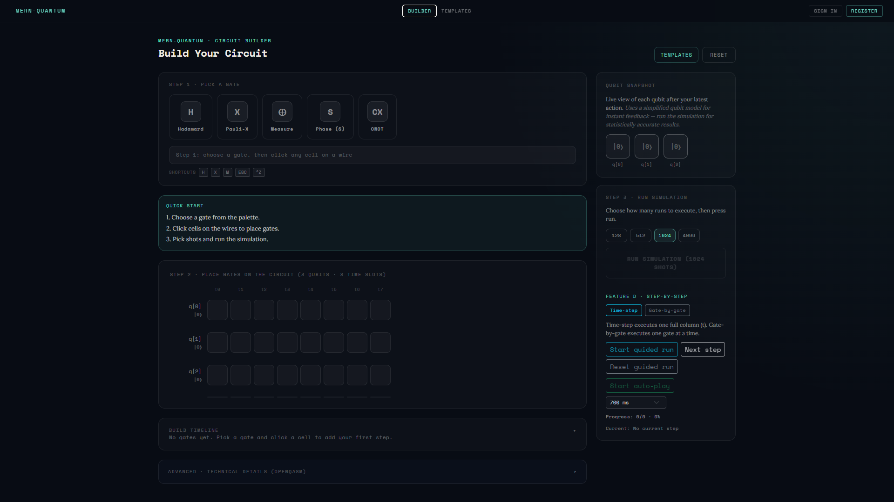
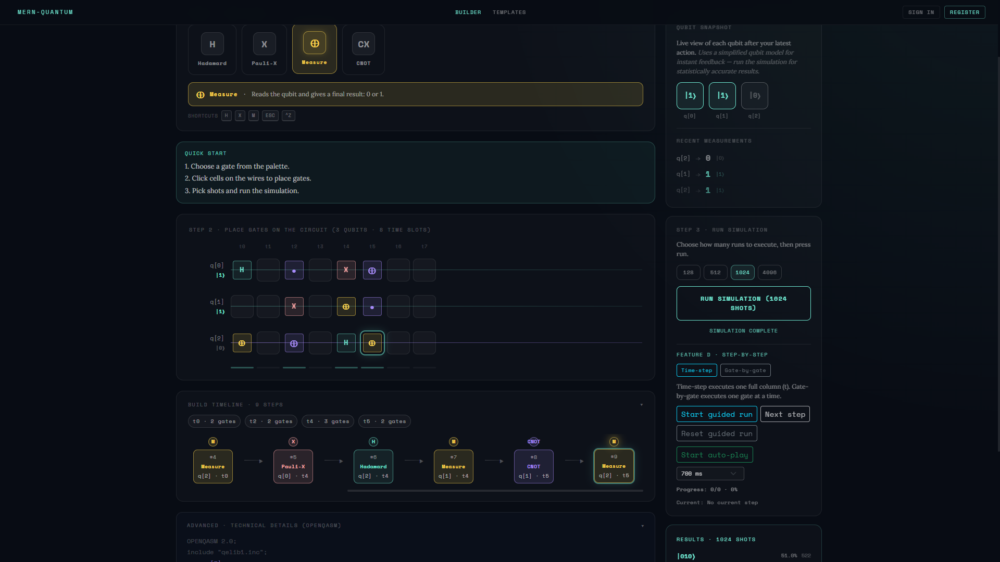
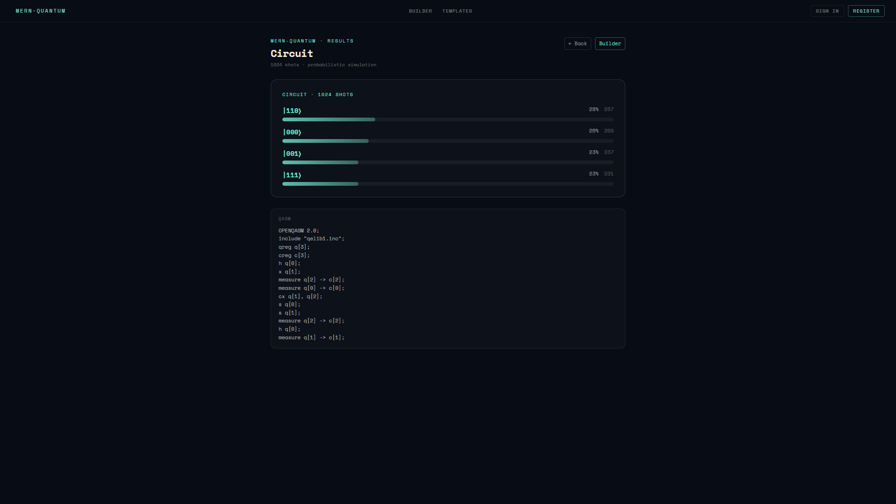
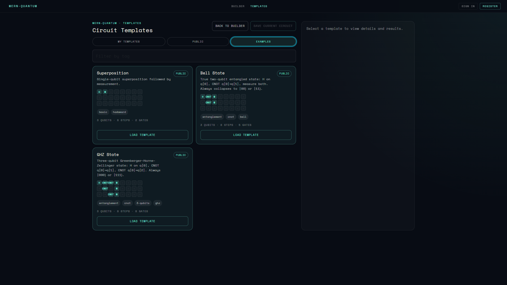
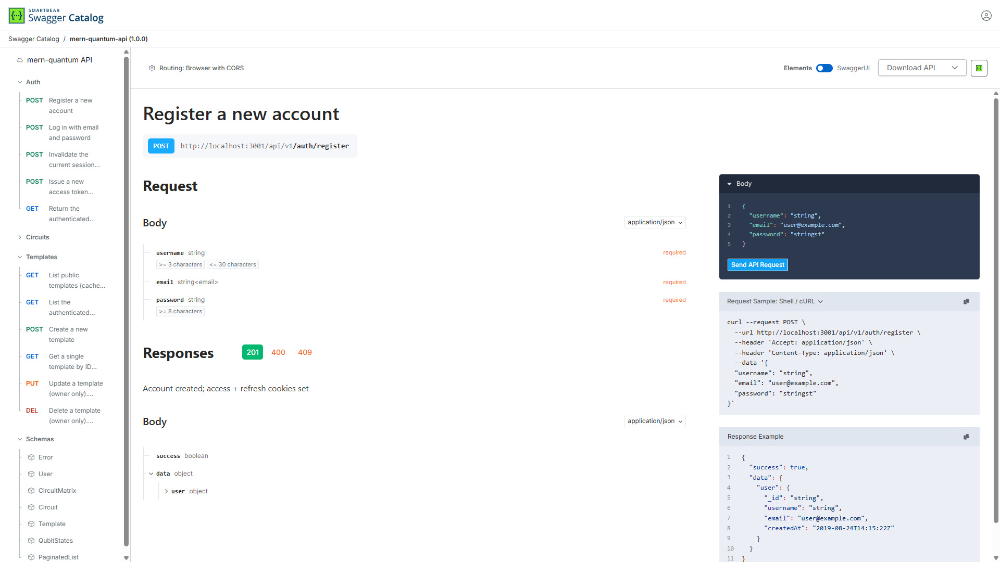

<div align="center">

# ⚛ mern-quantum

**Interactive Quantum Circuit Simulator — Full-Stack Capstone Project**

[](https://github.com/mattiagiuliani/mern-quantum/actions/workflows/ci.yml)
[](https://mern-quantum-frontend.vercel.app)
[](https://mern-quantum.onrender.com/api/v1/health)
[](./backend)
[](./frontend)
[](./backend)
[](./e2e)
[](https://nodejs.org)
[](https://react.dev)
[](https://expressjs.com)
[](https://mongoosejs.com)
[](./LICENSE)
[](http://localhost:3001/api/v1/docs)

> Build, simulate, and share quantum circuits in the browser.  
> Educational step-by-step mode · Statevector simulation · Community templates · JWT auth · Docker-ready.

</div>

---

## 🇬🇧 English

### Table of Contents

1. [Project Overview](#-project-overview)
2. [Screenshots](#-screenshots)
3. [Features](#-features)
4. [Architecture](#-architecture)
5. [Tech Stack](#-tech-stack)
6. [Security](#-security)
7. [Quantum Physics Models](#-quantum-physics-models)
8. [Beginner's Guide: Gates, Symbols & Simulation Modes](#-beginners-guide-gates-symbols--simulation-modes)
9. [Setup & Run](#-setup--run)
10. [Environment Variables](#-environment-variables)
11. [Testing](#-testing)
12. [API Reference](#-api-reference)
13. [Docker](#-docker)
14. [Deploy](#-deploy)
15. [Project Structure](#-project-structure)

---

### 🎯 Project Overview

**mern-quantum** is a production-grade full-stack web application that lets users design, simulate, and share quantum circuits directly in the browser. It was built as a Capstone project demonstrating advanced software engineering skills across the entire stack: secure REST API design, statevector quantum simulation, feature-first React architecture, and a comprehensive automated test suite.

The application is designed with two complementary goals:

- **Pedagogical**: step-by-step gate execution with a simplified qubit model gives learners immediate, human-readable feedback (`|0⟩`, `|1⟩`, `|+⟩`) after every action.
- **Accurate**: the multi-shot "Run Simulation" feature uses a real complex-amplitude statevector simulation (`Float64Array`) with correct entanglement and measurement collapse.

---

### 📸 Screenshots

| Circuit Builder | Step-by-Step Mode | Simulation Results |
|---|---|---|
|  |  |  |

| Templates Gallery | Swagger UI |
|---|---|
|  |  |

---

### ✨ Features

| Feature | Description |
|---|---|
| **Circuit Canvas** | Interactive drag-free gate placement on a qubit/time-step grid |
| **Gate Library** | H (Hadamard), X (Pauli-NOT), S (Phase), M (Measurement), CNOT (entanglement) |
| **Step-by-Step Mode** | Gate-by-gate or time-step-by-time-step execution with live qubit state panel |
| **Auto-Play** | Configurable interval auto-advancement through the step queue |
| **Multi-Shot Simulation** | Statevector simulation with configurable shots (preset: 128 / 512 / 1024 / 4096) |
| **Results Histogram** | Probability distribution bar chart + outcome count table |
| **QASM Preview** | Real-time OpenQASM 2.0 export of the current circuit |
| **Templates** | Create, browse (public / mine), preview, edit, and delete community circuits |
| **Authentication** | Register / login / logout / token refresh with HttpOnly JWT cookies |
| **Undo Stack** | Single-gesture undo (Ctrl+Z / Cmd+Z) for gate placement |
| **Keyboard Shortcuts** | Gate selection via keyboard, undo, deselect |
| **Save & Dashboard** | Named circuit persistence; per-user circuit list with pagination |
| **Confirm Dialogs** | Accessible `<ConfirmModal>` replaces all `window.confirm` calls |
| **Swagger UI** | Interactive API explorer at `/api/v1/docs` |
| **Docker** | Multi-stage Dockerfile + nginx reverse proxy + docker-compose |

---

### 🏗 Architecture

```
mern-quantum/
├── backend/                  Express API (Node.js ESM)
│   ├── controllers/          Route handlers (auth, circuit, template)
│   ├── services/             Business logic (quantum simulation)
│   ├── models/               Mongoose schemas (User, Circuit, Template)
│   ├── routes/               Express routers
│   ├── middleware/           Auth guard (FIFO cache), rate limit, Zod validation
│   ├── validators/           Zod schemas for all request bodies
│   ├── config/               DB connection, Sentry
│   ├── utils/                Logger (Pino), respond helpers
│   ├── openapi.json          OpenAPI 3.1 spec
│   └── server.e2e.js         E2E backend entry (MongoMemoryServer)
│
├── frontend/                 React 19 SPA (Vite)
│   └── src/
│       ├── features/         Feature-first modules
│       │   ├── circuit-builder/   Circuit canvas, hooks, gate logic
│       │   ├── multi-run/         Multi-shot simulation feature
│       │   ├── step-by-step/      Step-by-step execution + handlers
│       │   └── templates/         Template CRUD + preview
│       ├── pages/            Route-level components
│       ├── components/       Shared UI (ConfirmModal)
│       ├── api/              Axios client + error normalization
│       ├── context/          AuthContext (JWT cookie session)
│       └── hooks/            useAuth
│
├── e2e/                      Playwright E2E tests
│   ├── auth.real.e2e.js      Real backend tests (no mocks)
│   ├── auth.e2e.js           Mocked UI tests
│   ├── circuit-builder.e2e.js
│   ├── templates.e2e.js
│   └── full-workflow.e2e.js
│
└── docs/
    ├── ui-sketch.html        Interactive UI wireframe with API map
    └── screenshots/          circuit-builder, results, step-by-step, swagger, templates
```

**Data flow:**

```
Browser → nginx (:80) → /api/* → Express (:3001) → MongoDB
                      → /*     → React SPA (static)
```

---

### 🔧 Tech Stack

#### Backend

| Technology | Version | Role |
|---|---|---|
| Node.js | 22+ | Runtime |
| Express | 5 | HTTP framework |
| Mongoose | 9 | ODM for MongoDB |
| JSON Web Token | 9 | Access + refresh token auth |
| bcrypt | 6 | Password hashing (cost factor 10) |
| Zod | 4 | Runtime schema validation |
| Helmet | 8.1 | HTTP security headers + CSP |
| express-rate-limit | 8 | Per-user + per-IP rate limiting |
| Pino | 10 | Structured JSON logging |
| @sentry/node | 10 | Error tracking |
| mongodb-memory-server | 11 | In-memory DB for tests |

#### Frontend

| Technology | Version | Role |
|---|---|---|
| React | 19 | UI library |
| Vite | 8 | Build tool + dev server |
| React Router | 7 | Client-side routing |
| React Bootstrap | 2 | Component library |
| Axios | 1 | HTTP client |
| @sentry/react | 10 | Frontend error tracking |
| web-vitals | 5 | Core Web Vitals monitoring |

#### Testing & Quality

| Tool | Scope |
|---|---|
| Vitest + Supertest | Backend unit + integration (136 tests) |
| Vitest + @testing-library/react | Frontend unit + hooks (55 tests) |
| Playwright | E2E cross-browser (Chrome, Firefox, Safari) |
| ESLint | Linting with react-hooks + react-refresh plugins |
| Husky + lint-staged | Pre-commit ESLint enforcement |

---

### 🔒 Security

The application addresses the relevant OWASP Top 10 categories:

| Threat | Mitigation |
|---|---|
| **Broken Authentication** | HttpOnly JWT cookies (no localStorage), 15 min access token, 30-day refresh token rotation |
| **Injection** | Zod schema validation on all inputs; Mongoose parameterized queries |
| **Broken Access Control** | `protect` middleware on every mutating route; owner checks before update/delete |
| **Security Misconfiguration** | Helmet CSP, `X-Frame-Options`, `X-Content-Type-Options`; `trust proxy 1` for correct IP behind nginx |
| **Rate Limiting** | Auth limiter (20 req/15 min per IP); simulation limiter (30 req/min per user or IP) |
| **Sensitive Data Exposure** | `password` field excluded from all API responses; bcrypt cost 10 |
| **CORS** | Explicit allowlist via `CORS_ORIGIN` env var; `credentials: true` |
| **Password Policy** | Minimum 8 characters, at least one uppercase, one lowercase, one digit — validated both client-side and server-side (Zod regex) |
| **Auth Cache** | FIFO token verification cache (TTL 60 s, max 500 entries) to reduce DB load without stale-token risk |

---

### ⚛ Quantum Physics Models

The application intentionally implements **two distinct physics models** serving different educational purposes:

#### 1. Pedagogical Model — `applyGateStep()` (step-by-step feature)

Represents each qubit as `{ value: 0|1, superposition: boolean }`. Gives learners immediate, human-readable feedback (`|0⟩`, `|1⟩`, `|+⟩`) after every gate.

Known approximations (by design):
- H applied twice returns to the original deterministic state ✓
- X on a superposition leaves distribution unchanged (simplification: real X maps `|+⟩ → |+⟩` with phase change)
- CNOT with a superposed control collapses it before entangling (avoids multi-qubit entanglement in the simplified model)

#### 2. Statevector Model — `simulate()` (run simulation feature)

Uses `Float64Array` of length `2 × 2ⁿ` storing `[re₀, im₀, re₁, im₁, …]`. Implements correct unitary gate application and measurement collapse. Produces accurate probability distributions for multi-shot runs.

Gates implemented: H (Hadamard), X (Pauli-X), S (Phase — multiplies |1⟩ amplitude by i), M (projective measurement with Born-rule collapse), CNOT (two-qubit controlled-NOT with full entanglement).

> The UI notes this distinction in the Live State Panel: _"Uses a simplified qubit model for instant feedback — run the simulation for statistically accurate results."_

---

### � Beginner's Guide: Gates, Symbols & Simulation Modes

New to quantum computing? This section explains every concept visible in the app from scratch — no physics background required.

#### What is a Qubit?

A classical **bit** can only be 0 or 1. A **qubit** (quantum bit) can exist in a **superposition** of both values simultaneously. Think of it like a spinning coin: while it spins it is neither heads nor tails — it only "chooses" when it lands (when you measure it).

In mern-quantum, qubits are the **rows** of the circuit canvas. Time flows left to right across the **columns**.

---

#### Reading the Symbols

The circuit canvas is a **rows × columns** grid:

- **`q[0]`, `q[1]`, `q[2]` …** — Qubit labels (rows). `q[0]` is the top qubit, `q[1]` the second, and so on.
- **`t[0]`, `t[1]`, `t[2]` …** — Time-step labels (columns). `t[0]` is the first column of gates, `t[1]` the second, and so on.

The **Live State Panel** (step-by-step mode) shows the state of each qubit in **Dirac ket notation** (`|…⟩`):

- **`|0⟩`** — The qubit is definitely **0** (classical zero, fully determined)
- **`|1⟩`** — The qubit is definitely **1** (classical one, fully determined)
- **`|+⟩`** — The qubit is in **superposition**: 50 % chance of 0, 50 % chance of 1

The **results histogram** labels outcomes as the combined state of all qubits, read left-to-right as q[0], q[1], …:

- **`|00⟩`** — Both qubits measured as 0
- **`|01⟩`** — q[0] = 0, q[1] = 1
- **`|10⟩`** — q[0] = 1, q[1] = 0
- **`|11⟩`** — Both qubits measured as 1

> The `|…⟩` notation is standard **Dirac notation** from quantum physics — it simply labels a quantum state. The arrow `→ c[n]` in the QASM preview (`measure q[n] -> c[n]`) means "store the result in classical bit n".

---

#### The Quantum Gates

##### H — Hadamard Gate

| Qubits | QASM | Keyboard shortcut |
|---|---|---|
| 1 | `h q[n];` | `H` |

**What it does:** Creates superposition. A qubit that was `|0⟩` becomes `|+⟩` (equal probability of 0 and 1). Applied a second time it reverses: `|+⟩` → `|0⟩`.

**Analogy:** Imagine a light switch that, instead of being on or off, is set to "flickering". The Hadamard gate is the action that puts it in that undecided state.

**Why it matters:** H is the starting point of virtually every quantum algorithm. Without it, qubits stay classical. The superposition it creates allows the circuit to explore many values at once, which is the core of quantum parallelism.

---

##### X — Pauli-X Gate (Quantum NOT)

| Qubits | QASM | Keyboard shortcut |
|---|---|---|
| 1 | `x q[n];` | `X` |

**What it does:** Flips a qubit. `|0⟩` → `|1⟩` and `|1⟩` → `|0⟩`. This is the direct quantum equivalent of a classical NOT gate.

**Analogy:** Flipping a light switch from off to on (or vice versa).

**Why it matters:** Used to prepare specific initial states (for example, forcing `q[1]` to start as `|1⟩`) and as a building block inside more complex operations.

---

##### S — Phase Gate

| Qubits | QASM | Keyboard shortcut |
|---|---|---|
| 1 | `s q[n];` | `S` |

**What it does:** Applies a 90° phase rotation to the `|1⟩` component of the qubit's state. It does **not** change the probability of measuring 0 or 1 — if you measured immediately after S the outcome distribution would look identical. What it changes is the internal "angle" of the quantum state, which affects how subsequent Hadamard gates behave and how amplitudes interfere.

**Analogy:** Rotating the minute hand of a clock by 15 minutes. The clock face looks almost the same, but the position matters once you start combining it with other movements.

**Why it matters:** Essential for algorithms that rely on quantum interference (e.g., Quantum Fourier Transform, phase estimation). The S gate is what lets circuits produce interference patterns beyond a simple 50/50 split.

---

##### M — Measurement

| Qubits | QASM | Keyboard shortcut |
|---|---|---|
| 1 | `measure q[n] -> c[n];` | `M` |

**What it does:** Observes the qubit and collapses its superposition. If the qubit was in `|+⟩` (50/50), the measurement randomly picks `|0⟩` or `|1⟩` according to the quantum probabilities. From that moment the qubit is in a definite classical state — the superposition is gone.

**Analogy:** Catching the spinning coin mid-air. The moment you grab it, it is either heads or tails — the indeterminate spinning ends.

**Why it matters:** Measurement is the **only** way to extract a classical result from a quantum circuit. In the multi-shot simulation, each "shot" is a fresh execution of the circuit followed by a measurement — the app counts how many times each outcome (`|0⟩`, `|1⟩`, `|00⟩`, etc.) appears.

---

##### CNOT — Controlled NOT (Two-Qubit Gate)

| Qubits | QASM | Shown in canvas |
|---|---|---|
| 2 | `cx q[ctrl], q[tgt];` | Control: filled dot `●` / Target: `⊕` |

**What it does:** A conditional flip. The **control qubit** (shown as `●`) decides what happens to the **target qubit** (shown as `⊕`):
- If control = `|0⟩` → nothing happens to the target
- If control = `|1⟩` → the target is flipped (X gate applied to it)

To place a CNOT, select the CNOT gate from the palette, click the **control cell** first, then the **target cell** — or use the canvas drag handle.

**Analogy:** A light switch that only activates if a second "master" switch is already on. The master switch is the control — it enables or disables the flip.

**Why it matters:** CNOT is the gate that creates **quantum entanglement** — a uniquely quantum phenomenon where two qubits become so correlated that measuring one instantly determines the other, no matter the physical distance between them.

**Classic example — Bell State (maximum entanglement):**

```
q[0]: ── H ── ●── M
              │
q[1]: ──────── ⊕── M
```

1. Apply `H` to `q[0]` → `q[0]` enters superposition `|+⟩`
2. Apply `CNOT` (control = `q[0]`, target = `q[1]`)
3. Result: `q[0]` and `q[1]` are **entangled**. Measuring `q[0]` as `|0⟩` guarantees `q[1]` = `|0⟩`; measuring `q[0]` as `|1⟩` guarantees `q[1]` = `|1⟩`.
4. The results histogram shows **only** `|00⟩` and `|11⟩` — never `|01⟩` or `|10⟩`.

---

#### Multi-Shot Simulation: 128, 512, 1024

Because quantum measurement is inherently **probabilistic**, running a circuit once gives only a single random outcome. To see the full **probability distribution**, the simulator repeats the entire circuit many times and tallies the results. Each repetition is called a **shot**.

| Shots | Speed | Accuracy | Best used for |
|---|---|---|---|
| **128** | Fastest | Low — results may deviate noticeably from theory | Quick exploration and iteration |
| **512** | Medium | Good — probability peaks are usually clear | General use |
| **1024** | High | Very high — the histogram closely matches theoretical probabilities | Verifying a circuit's correctness |
| **4096** | Slowest | Highest — negligible statistical noise; bars are almost exactly at theoretical height | Precise probability measurements; academic or demo use |

**Concrete example — single qubit: `H` then `M`** (theoretical: exactly 50 % `|0⟩`, 50 % `|1⟩`):

- **128 shots:** might show 58 × `|0⟩` / 70 × `|1⟩` — statistical noise is visible
- **512 shots:** might show 247 × `|0⟩` / 265 × `|1⟩` — clearly centred on 50 %
- **1024 shots:** might show 505 × `|0⟩` / 519 × `|1⟩` — very close to 512 / 512
- **4096 shots:** might show 2041 × `|0⟩` / 2055 × `|1⟩` — essentially indistinguishable from the theoretical 2048 / 2048

The shot count is the **sample size** of the experiment — like flipping a coin: 10 flips might give 7 heads, but 10 000 flips will be very close to 5 000 heads. More shots = less statistical noise = histogram bars closer to their theoretical heights.

> The full-page **Results view** ("View Full Results" button) shows the same histogram at a larger scale, together with the QASM code that produced the results.

---

#### Step-by-Step Modes: Gate-by-Gate vs Time-Step

The **Step-by-Step** feature pauses execution after every advance and updates the Live State Panel so you can see exactly what each gate does to the qubits. There are two granularity modes:

##### Gate-by-Gate

Advances **one gate at a time**, scanning the circuit left to right, top to bottom. After each gate the Live State Panel shows the new state of that specific qubit.

```
Step 1 → apply H  on q[0]               — q[0] becomes |+⟩
Step 2 → apply CNOT (ctrl=q[0], tgt=q[1]) — both qubits become entangled
Step 3 → apply M  on q[0]               — collapses q[0]
Step 4 → apply M  on q[1]               — collapses q[1]
```

**Best for:** Understanding the individual contribution of each gate. Ideal when learning, because you can pause and think after every single operation.

##### Time-Step

Advances **one column at a time**. All gates in the same column (the same time step `t[n]`) execute simultaneously — just like a real quantum processor, where independent qubit operations in the same clock cycle run in parallel.

```
Time step t[0] → apply H  on q[0]                    (q[1] idle)
Time step t[1] → apply CNOT (ctrl=q[0], tgt=q[1])
Time step t[2] → apply M on q[0] AND M on q[1]        (both at once)
```

**Best for:** Seeing the computation at the level of clock cycles. Closer to how a real quantum computer schedules gate execution.

##### Auto-Play

The **Auto-Play** button runs the steps automatically at a configurable speed (use the interval slider to set the delay in milliseconds). Useful for live demonstrations or for watching a circuit animate without clicking manually at every step. Press **Stop** at any time to pause.

---

### �🚀 Setup & Run

#### Prerequisites

- Node.js ≥ 22
- npm ≥ 10
- MongoDB (local or Atlas) — **only needed for production/dev**; tests use `mongodb-memory-server`

#### 1. Clone and install

```bash
git clone https://github.com/mattiagiuliani/mern-quantum.git
cd mern-quantum
npm install
```

#### 2. Configure environment variables

Create `backend/.env`:

```env
MONGODB_URI=mongodb://localhost:27017/mern-quantum
JWT_SECRET=replace-with-32-char-random-string
JWT_REFRESH_SECRET=replace-with-another-32-char-string
JWT_EXPIRES_IN=15m
JWT_REFRESH_EXPIRES_IN=30d
CORS_ORIGIN=http://localhost:5173
PORT=3001
```

Create `frontend/.env.local`:

```env
VITE_API_URL=http://localhost:3001/api/v1
```

#### 3. Run in development

```bash
# Terminal 1 — backend
npm run dev:backend

# Terminal 2 — frontend
npm run dev:frontend
```

Open **http://localhost:5173**

#### 4. API Explorer (Swagger UI)

With the backend running, open **http://localhost:3001/api/v1/docs**

---

### 🌍 Environment Variables

| Variable | Required | Default | Description |
|---|---|---|---|
| `MONGODB_URI` | ✅ | — | MongoDB connection string |
| `JWT_SECRET` | ✅ | — | HMAC secret for access tokens |
| `JWT_REFRESH_SECRET` | ✅ | — | HMAC secret for refresh tokens |
| `JWT_EXPIRES_IN` | ❌ | `15m` | Access token TTL |
| `JWT_REFRESH_EXPIRES_IN` | ❌ | `30d` | Refresh token TTL |
| `CORS_ORIGIN` | ✅ | — | Comma-separated allowed origins |
| `PORT` | ❌ | `3001` | Backend listening port |
| `VITE_API_URL` | ✅ (frontend) | — | Backend base URL for Axios |

---

### 🧪 Testing

#### Unit + Integration

```bash
# Backend — 136 tests (controllers, services, routes, middleware)
npm run test:backend

# Frontend — 55 tests (hooks, utils, components)
npm run test:frontend

# Both
npm test
```

Backend tests use `mongodb-memory-server` — no external database required.

#### End-to-End (Playwright)

```bash
# All browsers (Chrome, Firefox, Safari)
npm run test:e2e

# Interactive UI mode
npm run test:e2e:ui

# Debug mode
npm run test:e2e:debug

# Only real backend tests (no mocks)
npx playwright test auth.real.e2e.js --project=chromium
```

Playwright automatically starts:
- The frontend dev server on port 5173
- A real Express backend with `MongoMemoryServer` on port 3001

The `auth.real.e2e.js` suite runs **without any `page.route()` mocks** — it exercises the full stack: React → Axios → Express → Mongoose → MongoMemoryServer.

#### Test Coverage Summary

| Suite | Tests | What is covered |
|---|---|---|
| Backend unit (controllers, services) | 35 | Auth flow, quantum gates, template CRUD |
| Backend integration (routes) | 42 | Full HTTP request/response cycle |
| Frontend unit (hooks, utils) | 55 | Gate logic, multi-run utils, hook behavior |
| E2E mocked | 20+ | UI interactions, navigation, state transitions |
| E2E real (no mocks) | 3 | Register, login error, login success |

---

### 📡 API Reference

Base URL: `http://localhost:3001/api/v1`

Interactive docs: **http://localhost:3001/api/v1/docs** (Swagger UI)  
Machine-readable spec: **http://localhost:3001/api/v1/openapi.json** (OpenAPI 3.1)

#### Auth endpoints

| Method | Path | Auth | Description |
|---|---|---|---|
| `POST` | `/auth/register` | — | Create account, set auth cookies |
| `POST` | `/auth/login` | — | Authenticate, set auth cookies |
| `POST` | `/auth/logout` | — | Clear cookies |
| `POST` | `/auth/refresh` | — | Rotate access token using refresh cookie |
| `GET` | `/auth/me` | 🔒 | Return current user profile |

#### Circuit endpoints

| Method | Path | Auth | Description |
|---|---|---|---|
| `POST` | `/circuits/run` | — | Statevector simulation (shots-based) |
| `POST` | `/circuits/applyGate` | — | Pedagogical single-gate application |
| `POST` | `/circuits` | 🔒 | Save new circuit |
| `GET` | `/circuits/mine` | 🔒 | List own circuits (paginated) |
| `GET` | `/circuits/:id` | 🔒 | Get circuit by ID |
| `PUT` | `/circuits/:id` | 🔒 | Update circuit |
| `DELETE` | `/circuits/:id` | 🔒 | Delete circuit |

#### Template endpoints

| Method | Path | Auth | Description |
|---|---|---|---|
| `GET` | `/templates/public` | — | List public templates (paginated, filterable by tag) |
| `GET` | `/templates/mine` | 🔒 | List own templates |
| `GET` | `/templates/:id` | — | Get template (private = owner only) |
| `POST` | `/templates` | 🔒 | Create template |
| `PUT` | `/templates/:id` | 🔒 | Update own template |
| `DELETE` | `/templates/:id` | 🔒 | Delete own template |

Response contract:

```json
{ "success": true, "data": { ... } }
{ "success": false, "message": "Human-readable error" }
```

---

### 🐳 Docker

```bash
# Build and start all services
docker compose up --build

# Stop
docker compose down
```

The stack:
- **backend** container: Node.js API on port 3001 (not published to the host — reachable only through nginx)
- **frontend** container: nginx on port 80, proxies `/api/` to backend

nginx serves the React SPA with SPA fallback (`try_files $uri /index.html`). HSTS and TLS are handled by the external reverse proxy (Traefik, Caddy, etc.) in front of this stack.

#### Development override

A `docker-compose.override.yml` is included that re-exposes port 3001 for local development and sets `NODE_ENV=development`. It is automatically loaded by `docker compose up` but **not** by `docker compose -f docker-compose.yml up` (production).

#### Production Secrets

For production deployments, do not pass secrets via `.env` files checked into version control. Use one of:
- [Docker Secrets](https://docs.docker.com/engine/swarm/secrets/) (Swarm mode)
- A secrets manager (AWS Secrets Manager, HashiCorp Vault, Azure Key Vault)
- CI/CD injected environment variables (GitHub Actions `secrets`, Railway, Render)

---

### 🌐 Deploy

| Service | URL |
|---|---|
| **Frontend** (Vercel) | [mern-quantum-frontend.vercel.app](https://mern-quantum-frontend.vercel.app) |
| **Backend** (Render) | [mern-quantum.onrender.com](https://mern-quantum.onrender.com) |

> **Note:** The Render free tier has cold starts — the first request after a period of inactivity may take ~30 seconds.

#### Frontend — Vercel

Deployed automatically from the `main` branch via Vercel's GitHub integration.

**Build settings** (Vercel dashboard → Project → Settings → General):

| Setting | Value |
|---|---|
| Root Directory | `frontend` |
| Build Command | `npm run build` |
| Output Directory | `dist` |
| Install Command | *(leave default — Vercel installs from the workspace root)* |

**Environment variable** (Vercel → Project → Settings → Environment Variables):

| Variable | Value |
|---|---|
| `VITE_API_URL` | `https://mern-quantum.onrender.com/api/v1` |

#### Backend — Render

Deployed as a Docker container using the `render.yaml` blueprint in the repository root.

**Environment variables** (Render → Service → Environment):

| Variable | How to set |
|---|---|
| `MONGODB_URI` | Paste your [MongoDB Atlas](https://cloud.mongodb.com) connection string |
| `JWT_SECRET` | Auto-generated by Render (`generateValue: true`) |
| `JWT_REFRESH_SECRET` | Auto-generated by Render |
| `CORS_ORIGIN` | `https://mern-quantum-frontend.vercel.app` |
| `NODE_ENV` | `production` (pre-set in `render.yaml`) |
| `PORT` | `3001` (pre-set in `render.yaml`) |

**First-time deploy steps:**

1. Push the repository to GitHub.
2. Go to [dashboard.render.com](https://dashboard.render.com) → **New → Blueprint** → connect the repo.
3. Render reads `render.yaml` and creates the `mern-quantum-backend` service automatically.
4. In the Render dashboard, set `MONGODB_URI` and `CORS_ORIGIN` (both marked `sync: false` in the blueprint — they must be filled in manually).
5. In the Vercel dashboard, set `VITE_API_URL` to `https://<render-service-name>.onrender.com/api/v1`.
6. Trigger a new Vercel deployment to bake the updated API URL into the frontend bundle.

---

### 📁 Project Structure (detailed)

```
mern-quantum/
├── backend/
│   ├── app.js                    Express factory (CSP, CORS, routes, Swagger)
│   ├── server.js                 Production entry point
│   ├── server.e2e.js             E2E entry (MongoMemoryServer)
│   ├── openapi.json              OpenAPI 3.1 specification
│   ├── config/
│   │   ├── db.js                 connectDB()
│   │   └── sentry.js             Sentry init
│   ├── controllers/
│   │   ├── auth.controller.js    register / login / logout / refresh / me
│   │   ├── circuit.controller.js run / applyGate / CRUD
│   │   └── template.controller.js CRUD + public listing
│   ├── middleware/
│   │   ├── auth.middleware.js    JWT verify + FIFO user cache
│   │   ├── perf.js               Request timing logger
│   │   └── validate.js           Zod middleware factory
│   ├── models/
│   │   ├── User.model.js         username, email, password (hashed)
│   │   ├── Circuit.model.js      owner, name, matrix, lastResult
│   │   └── Template.model.js     name, tags, circuit, isPublic, author
│   ├── routes/
│   │   ├── auth.routes.js
│   │   ├── circuit.routes.js
│   │   └── template.routes.js
│   ├── services/
│   │   └── quantum.service.js    applyGateStep() + simulate() (statevector)
│   ├── validators/
│   │   ├── auth.schemas.js       emailSchema, passwordSchema (min 8 + regex)
│   │   ├── circuit.schemas.js
│   │   └── template.schemas.js
│   └── utils/
│       ├── logger.js             Pino instance
│       ├── respond.js            ok() / fail() helpers
│       └── circuitValidation.js
│
├── frontend/src/
│   ├── App.jsx                   Router + AuthContext provider
│   ├── api/
│   │   ├── apiClient.js          Axios instance + interceptors
│   │   └── apiError.js           Error normalization
│   ├── components/
│   │   └── ConfirmModal.jsx      Accessible confirm dialog
│   ├── context/
│   │   └── AuthContext.jsx       Session state + login/register/logout
│   ├── features/
│   │   ├── circuit-builder/      Canvas, hooks, palette, QASM, live state
│   │   ├── multi-run/            Shot presets, run orchestration, histogram
│   │   ├── step-by-step/         Queue, status FSM, useStepByStepHandlers
│   │   └── templates/            Template list, preview, save modal
│   ├── pages/
│   │   ├── CircuitBuilderPage.jsx
│   │   ├── TemplatesPage.jsx
│   │   ├── DashboardPage.jsx
│   │   ├── ResultsPage.jsx
│   │   ├── LoginPage.jsx
│   │   ├── RegisterPage.jsx
│   │   └── Homepage.jsx
│   └── hooks/
│       └── useAuth.js
│
├── e2e/
│   ├── auth.real.e2e.js          Real stack E2E (no mocks)
│   ├── auth.e2e.js
│   ├── circuit-builder.e2e.js
│   ├── templates.e2e.js
│   └── full-workflow.e2e.js
│
├── docs/
│   ├── ui-sketch.html            Interactive wireframe + API map
│   └── screenshots/              circuit-builder, results, step-by-step, swagger, templates
│
├── playwright.config.js          Two webServers: frontend + e2e backend
├── docker-compose.yml
└── package.json                  npm workspaces root
```

---

## 🇮🇹 Italiano

### Indice

1. [Panoramica del progetto](#-panoramica-del-progetto)
2. [Screenshot](#-screenshot-1)
3. [Funzionalità](#-funzionalità)
4. [Architettura](#-architettura-1)
5. [Stack tecnologico](#-stack-tecnologico)
6. [Sicurezza](#-sicurezza)
7. [Modelli fisici quantistici](#-modelli-fisici-quantistici)
8. [Guida per principianti: porte, simboli e modalità di simulazione](#-guida-per-principianti-porte-simboli-e-modalità-di-simulazione)
9. [Installazione ed esecuzione](#-installazione-ed-esecuzione)
10. [Variabili d'ambiente](#-variabili-dambiente)
11. [Testing](#-testing-1)
12. [Riferimento API](#-riferimento-api)
13. [Docker](#-docker-1)
14. [Deploy](#-deploy-1)

---

### 🎯 Panoramica del progetto

**mern-quantum** è un'applicazione web full-stack production-grade che permette agli utenti di progettare, simulare e condividere circuiti quantistici direttamente nel browser. È stata sviluppata come progetto Capstone per dimostrare competenze avanzate di ingegneria del software sull'intero stack: progettazione di API REST sicure, simulazione quantistica statevector, architettura React feature-first e una suite completa di test automatizzati.

L'applicazione è progettata con due obiettivi complementari:

- **Pedagogico**: l'esecuzione gate-by-gate con modello qubit semplificato fornisce agli studenti feedback immediato e leggibile (`|0⟩`, `|1⟩`, `|+⟩`) dopo ogni azione.
- **Accurato**: la funzione "Run Simulation" multi-shot usa una vera simulazione statevector ad ampiezza complessa (`Float64Array`) con entanglement corretto e collasso della misurazione.

---

### 📸 Screenshots

| Circuit Builder | Step-by-Step Mode | Simulation Results |
|---|---|---|
|  |  |  |

| Templates Gallery | Swagger UI |
|---|---|
|  |  |

---

### ✨ Funzionalità

| Funzionalità | Descrizione |
|---|---|
| **Canvas del circuito** | Posizionamento gate interattivo su griglia qubit/passo temporale |
| **Libreria gate** | H (Hadamard), X (Pauli-NOT), S (Phase), M (Misurazione), CNOT (entanglement) |
| **Modalità step-by-step** | Esecuzione gate per gate o passo per passo con pannello qubit live |
| **Auto-play** | Avanzamento automatico con intervallo configurabile |
| **Simulazione multi-shot** | Simulazione statevector con shot configurabili (128 / 512 / 1024 / 4096) |
| **Istogramma risultati** | Grafico a barre distribuzione probabilità + tabella conteggi |
| **Preview QASM** | Esportazione OpenQASM 2.0 in tempo reale del circuito corrente |
| **Template** | Crea, sfoglia (pubblici / miei), anteprima, modifica ed elimina circuiti |
| **Autenticazione** | Registrazione / login / logout / refresh token con cookie JWT HttpOnly |
| **Stack undo** | Undo con un gesto (Ctrl+Z / Cmd+Z) per il posizionamento dei gate |
| **Shortcut da tastiera** | Selezione gate da tastiera, undo, deseleziona |
| **Salvataggio e Dashboard** | Persistenza circuiti con nome; lista circuiti per utente con paginazione |
| **Dialog di conferma** | `<ConfirmModal>` accessibile sostituisce tutte le chiamate a `window.confirm` |
| **Swagger UI** | Explorer API interattivo su `/api/v1/docs` |
| **Docker** | Dockerfile multi-stage + reverse proxy nginx + docker-compose |

---

### 🏗 Architettura

La struttura è identica a quella descritta nella sezione inglese. Flusso dati:

```
Browser → nginx (:80) → /api/* → Express (:3001) → MongoDB
                      → /*     → React SPA (static)
```

---

### 🔧 Stack tecnologico

#### Backend

| Tecnologia | Versione | Ruolo |
|---|---|---|
| Node.js | 22+ | Runtime |
| Express | 5 | Framework HTTP |
| Mongoose | 9 | ODM per MongoDB |
| JSON Web Token | 9 | Auth token accesso + refresh |
| bcrypt | 6 | Hash password (cost factor 10) |
| Zod | 4 | Validazione schema runtime |
| Helmet | 8.1 | Header di sicurezza HTTP + CSP |
| express-rate-limit | 8 | Rate limiting per utente e per IP |
| Pino | 10 | Logging strutturato JSON |
| @sentry/node | 10 | Tracciamento errori |
| mongodb-memory-server | 11 | DB in-memory per i test |

#### Frontend

| Tecnologia | Versione | Ruolo |
|---|---|---|
| React | 19 | Libreria UI |
| Vite | 8 | Build tool + dev server |
| React Router | 7 | Routing client-side |
| React Bootstrap | 2 | Libreria di componenti |
| Axios | 1 | Client HTTP |
| @sentry/react | 10 | Tracciamento errori frontend |
| web-vitals | 5 | Monitoraggio Core Web Vitals |

#### Testing e qualità

| Strumento | Scope |
|---|---|
| Vitest + Supertest | Backend unit + integration (136 test) |
| Vitest + @testing-library/react | Frontend unit + hooks (55 test) |
| Playwright | E2E cross-browser (Chrome, Firefox, Safari) |
| ESLint | Linting con plugin react-hooks + react-refresh |
| Husky + lint-staged | ESLint pre-commit automatico |

---

### 🔒 Sicurezza

L'applicazione affronta le categorie rilevanti dell'OWASP Top 10:

| Minaccia | Mitigazione |
|---|---|
| **Broken Authentication** | Cookie JWT HttpOnly (no localStorage), access token 15 min, rotation refresh token 30 giorni |
| **Injection** | Validazione schema Zod su tutti gli input; query parametrizzate Mongoose |
| **Broken Access Control** | Middleware `protect` su ogni route che muta dati; controllo proprietario prima di update/delete |
| **Security Misconfiguration** | Helmet CSP, `X-Frame-Options`, `X-Content-Type-Options`; `trust proxy 1` per IP corretto dietro nginx |
| **Rate Limiting** | Auth limiter (20 req/15 min per IP); simulation limiter (30 req/min per utente o IP) |
| **Sensitive Data Exposure** | Campo `password` escluso da tutte le risposte API; bcrypt cost 10 |
| **CORS** | Lista consentiti esplicita via env var `CORS_ORIGIN`; `credentials: true` |
| **Password Policy** | Minimo 8 caratteri, almeno una maiuscola, una minuscola, una cifra — validato sia lato client (regex) che server (Zod) |
| **Auth Cache** | Cache FIFO verifica token (TTL 60 s, max 500 voci) per ridurre carico DB senza rischio token stale |

---

### ⚛ Modelli fisici quantistici

L'applicazione implementa intenzionalmente **due modelli fisici distinti** con scopi educativi diversi:

#### 1. Modello pedagogico — `applyGateStep()` (feature step-by-step)

Rappresenta ogni qubit come `{ value: 0|1, superposition: boolean }`. Fornisce feedback immediato e leggibile (`|0⟩`, `|1⟩`, `|+⟩`) dopo ogni gate.

Approssimazioni note (per design):
- H applicato due volte riporta allo stato deterministico originale ✓
- X in superposizione lascia invariata la distribuzione (semplificazione: il vero X mappa `|+⟩ → |+⟩` con cambio di fase)
- CNOT con controllo in superposizione lo collassa prima di entanglare (evita entanglement multi-qubit nel modello semplificato)

#### 2. Modello statevector — `simulate()` (feature run simulation)

Usa `Float64Array` di lunghezza `2 × 2ⁿ` che memorizza `[re₀, im₀, re₁, im₁, …]`. Implementa applicazione gate unitaria corretta e collasso della misurazione. Produce distribuzioni di probabilità accurate per esecuzioni multi-shot.

Gate implementati: H (Hadamard), X (Pauli-X), S (Phase — moltiplica l'ampiezza |1⟩ per i), M (misurazione proiettiva con collasso Born-rule), CNOT (NOT controllato a due qubit con entanglement completo).

---

### � Guida per principianti: porte, simboli e modalità di simulazione

Sei nuovo al calcolo quantistico? Questa sezione spiega ogni concetto visibile nell'app partendo da zero — nessuna conoscenza di fisica è richiesta.

#### Cos'è un Qubit?

Un **bit** classico può valere soltanto 0 o 1. Un **qubit** (quantum bit) può esistere in una **sovrapposizione** di entrambi i valori contemporaneamente. Immagina una moneta che gira su se stessa: mentre gira non è né testa né croce — "sceglie" soltanto quando si ferma (quando la misuri).

In mern-quantum, i qubit sono le **righe** del canvas del circuito. Il tempo scorre da sinistra a destra lungo le **colonne**.

---

#### Come leggere i simboli dell'app

Il canvas del circuito è una griglia **righe × colonne**:

- **`q[0]`, `q[1]`, `q[2]` …** — Etichette dei qubit (righe). `q[0]` è il qubit in cima, `q[1]` il secondo, e così via.
- **`t[0]`, `t[1]`, `t[2]` …** — Etichette dei passi temporali (colonne). `t[0]` è la prima colonna di porte, `t[1]` la seconda, e così via.

Il **pannello stato live** (modalità step-by-step) mostra lo stato di ogni qubit con la **notazione ket di Dirac** (`|…⟩`):

- **`|0⟩`** — Il qubit è certamente **0** (zero classico, stato definito)
- **`|1⟩`** — Il qubit è certamente **1** (uno classico, stato definito)
- **`|+⟩`** — Il qubit è in **sovrapposizione**: 50% di probabilità di 0, 50% di 1

L'**istogramma dei risultati** etichetta gli esiti come stato combinato di tutti i qubit, letto da sinistra a destra come q[0], q[1], …:

- **`|00⟩`** — Entrambi i qubit misurati come 0
- **`|01⟩`** — q[0] = 0, q[1] = 1
- **`|10⟩`** — q[0] = 1, q[1] = 0
- **`|11⟩`** — Entrambi i qubit misurati come 1

> La notazione `|…⟩` è la **notazione di Dirac** standard della fisica quantistica — indica semplicemente uno stato quantistico. La freccia `→ c[n]` nel preview QASM (`measure q[n] -> c[n]`) significa "memorizza il risultato nel bit classico n".

---

#### Le porte quantistiche

##### H — Porta di Hadamard

| Qubit | QASM | Scorciatoia |
|---|---|---|
| 1 | `h q[n];` | `H` |

**Cosa fa:** Crea la sovrapposizione. Un qubit che era `|0⟩` diventa `|+⟩` (uguale probabilità di 0 e 1). Applicata una seconda volta, inverte: `|+⟩` → `|0⟩`.

**Analogia:** Immagina un interruttore della luce che invece di essere acceso o spento si trova in uno stato "che lampeggia". La porta Hadamard è il gesto che lo mette in quello stato indeciso.

**Perché è importante:** H è il punto di partenza di quasi ogni algoritmo quantistico. Senza di essa i qubit restano classici. La sovrapposizione che crea permette al circuito di esplorare molti valori contemporaneamente — il cuore del parallelismo quantistico.

---

##### X — Porta di Pauli-X (NOT quantistico)

| Qubit | QASM | Scorciatoia |
|---|---|---|
| 1 | `x q[n];` | `X` |

**Cosa fa:** Inverte il qubit. `|0⟩` → `|1⟩` e `|1⟩` → `|0⟩`. È l'equivalente quantistico diretto di una porta NOT classica.

**Analogia:** Girare un interruttore della luce da spento ad acceso (o viceversa).

**Perché è importante:** Usata per preparare stati iniziali specifici (es. inizializzare `q[1]` come `|1⟩`) e come mattone di base all'interno di operazioni più complesse.

---

##### S — Porta di fase (Phase Gate)

| Qubit | QASM | Scorciatoia |
|---|---|---|
| 1 | `s q[n];` | `S` |

**Cosa fa:** Applica una rotazione di fase di 90° alla componente `|1⟩` del qubit. **Non** cambia la probabilità di misurare 0 o 1 — se misurassi subito dopo S, la distribuzione dei risultati sembrerebbe identica. Ciò che cambia è l'"angolo" interno dello stato quantistico, che influenza il comportamento delle successive porte Hadamard e il modo in cui le ampiezze interferiscono.

**Analogia:** Ruotare la lancetta dei minuti di un orologio di 15 minuti. Il quadrante sembra quasi uguale, ma la posizione conta non appena si inizia a combinare con altri movimenti.

**Perché è importante:** Indispensabile per algoritmi che sfruttano l'interferenza quantistica (es. Quantum Fourier Transform, stima di fase). La porta S permette ai circuiti di produrre pattern di interferenza oltre la semplice divisione 50/50.

---

##### M — Misurazione

| Qubit | QASM | Scorciatoia |
|---|---|---|
| 1 | `measure q[n] -> c[n];` | `M` |

**Cosa fa:** Osserva il qubit e collassa la sua sovrapposizione. Se il qubit era in `|+⟩` (50/50), la misurazione sceglie casualmente `|0⟩` o `|1⟩` in base alle probabilità quantistiche. Da quel momento il qubit è in uno stato classico definito — la sovrapposizione è scomparsa.

**Analogia:** Afferrare la moneta che gira a mezz'aria. Nel momento in cui la prendi, è o testa o croce — l'indeterminazione finisce.

**Perché è importante:** La misurazione è l'**unico** modo per estrarre un risultato classico da un circuito quantistico. Nella simulazione multi-shot, ogni "shot" è una nuova esecuzione del circuito seguita da una misurazione — l'app conta quante volte appare ciascun esito (`|0⟩`, `|1⟩`, `|00⟩`, ecc.).

---

##### CNOT — NOT Controllato (porta a due qubit)

| Qubit | QASM | Nel canvas |
|---|---|---|
| 2 | `cx q[ctrl], q[tgt];` | Controllo: `●` / Target: `⊕` |

**Cosa fa:** Un'inversione condizionale. Il **qubit di controllo** (`●`) decide cosa accade al **qubit target** (`⊕`):
- Se controllo = `|0⟩` → nulla accade al target
- Se controllo = `|1⟩` → il target viene invertito (gli viene applicata la porta X)

Per posizionare un CNOT: seleziona la porta CNOT dalla palette, clicca prima sulla **cella di controllo** e poi sulla **cella target**.

**Analogia:** Un interruttore della luce che funziona solo se un secondo interruttore "master" è già acceso. Il master è il controllo — abilita o disabilita l'inversione.

**Perché è importante:** CNOT è la porta che crea l'**entanglement quantistico** — un fenomeno esclusivamente quantistico in cui due qubit diventano così correlati che misurare l'uno determina immediatamente l'altro, indipendentemente dalla distanza fisica tra essi.

**Circuito classico — Bell State (entanglement massimo):**

```
q[0]: ── H ── ●── M
              │
q[1]: ──────── ⊕── M
```

1. Applica `H` su `q[0]` → `q[0]` entra in sovrapposizione `|+⟩`
2. Applica `CNOT` (controllo = `q[0]`, target = `q[1]`)
3. Risultato: `q[0]` e `q[1]` sono **entangled**. Misurare `q[0]` come `|0⟩` garantisce `q[1]` = `|0⟩`; misurare `q[0]` come `|1⟩` garantisce `q[1]` = `|1⟩`.
4. L'istogramma mostrerà **solo** `|00⟩` e `|11⟩` — mai `|01⟩` o `|10⟩`.

---

#### Simulazione Multi-Shot: 128, 512, 1024

Poiché la misurazione quantistica è intrinsecamente **probabilistica**, eseguire il circuito una sola volta produce un unico risultato casuale. Per vedere la **distribuzione di probabilità** completa, il simulatore ripete l'intero circuito molte volte e conta i risultati. Ogni ripetizione si chiama **shot**.

| Shot | Velocità | Precisione | Ideale per |
|---|---|---|---|
| **128** | Massima | Bassa — i risultati possono discostarsi visibilmente dalla teoria | Esplorazione rapida e iterazione veloce |
| **512** | Media | Buona — i picchi di probabilità sono di solito chiari | Uso generale |
| **1024** | Alta | Molto alta — l'istogramma è molto vicino alle probabilità teoriche | Verificare il comportamento corretto di un circuito |
| **4096** | Minima | Massima — rumore statistico trascurabile; le barre sono quasi esattamente all'altezza teorica | Misurazioni precise; uso accademico o per demo |

**Esempio concreto — qubit singolo: `H` poi `M`** (teorico: esattamente 50% `|0⟩`, 50% `|1⟩`):

- **128 shot:** potrebbe mostrare 58 × `|0⟩` / 70 × `|1⟩` — il rumore statistico è evidente
- **512 shot:** potrebbe mostrare 247 × `|0⟩` / 265 × `|1⟩` — chiaramente centrato sul 50%
- **1024 shot:** potrebbe mostrare 505 × `|0⟩` / 519 × `|1⟩` — molto vicino al valore teorico di 512 ciascuno
- **4096 shot:** potrebbe mostrare 2041 × `|0⟩` / 2055 × `|1⟩` — praticamente indistinguibile dal valore teorico di 2048 ciascuno

Il numero di shot è analogo alla **dimensione del campione** in un esperimento statistico: lanciare una moneta 10 volte può dare 7 testa, ma lanciarla 10 000 volte darà un risultato molto vicino a 5 000 testa. Più shot = meno rumore statistico = barre dell'istogramma più vicine all'altezza teorica.

> La **vista risultati completa** (pulsante "View Full Results") mostra lo stesso istogramma in grande, insieme al codice QASM che ha prodotto i risultati.

---

#### Modalità step-by-step: gate per gate vs passo temporale

La funzione **Step-by-Step** mette in pausa l'esecuzione dopo ogni avanzamento e aggiorna il pannello dello stato live così da vedere esattamente cosa fa ogni porta sui qubit. Esistono due modalità di granularità:

##### Gate per gate

Avanza **una porta alla volta**, scansionando il circuito da sinistra a destra e dall'alto in basso. Dopo ogni porta il pannello mostra il nuovo stato di quel qubit specifico.

```
Passo 1 → applica H  su q[0]                     — q[0] diventa |+⟩
Passo 2 → applica CNOT (ctrl=q[0], tgt=q[1])      — i due qubit si entanglano
Passo 3 → applica M  su q[0]                     — q[0] collassa
Passo 4 → applica M  su q[1]                     — q[1] collassa
```

**Ideale per:** Capire il contributo individuale di ogni porta. Perfetto per chi sta imparando, perché si può fermarsi a riflettere dopo ogni singola operazione.

##### Passo temporale

Avanza **una colonna alla volta**. Tutte le porte posizionate nella stessa colonna (lo stesso passo temporale `t[n]`) vengono eseguite contemporaneamente — proprio come un processore quantistico reale, dove le operazioni su qubit indipendenti avvengono nello stesso ciclo di clock in parallelo.

```
Passo temporale t[0] → applica H  su q[0]                    (q[1] inattivo)
Passo temporale t[1] → applica CNOT (ctrl=q[0], tgt=q[1])
Passo temporale t[2] → applica M su q[0] E M su q[1]         (entrambi contemporaneamente)
```

**Ideale per:** Vedere il quadro complessivo di ogni fase di calcolo. Più vicino a come un vero computer quantistico pianifica l'esecuzione dei gate.

##### Auto-play

Il pulsante **Auto-play** esegue i passi automaticamente a una velocità configurabile (usa il cursore dell'intervallo per impostare il ritardo in millisecondi). Utile per dimostrazioni dal vivo o per guardare il circuito "animarsi" senza cliccare manualmente a ogni passo. Premi **Stop** in qualsiasi momento per mettere in pausa.

---

### �🚀 Installazione ed esecuzione

#### Prerequisiti

- Node.js ≥ 22
- npm ≥ 10
- MongoDB (locale o Atlas) — **necessario solo per produzione/sviluppo**; i test usano `mongodb-memory-server`

#### 1. Clona e installa

```bash
git clone https://github.com/mattiagiuliani/mern-quantum.git
cd mern-quantum
npm install
```

#### 2. Configura le variabili d'ambiente

Crea `backend/.env`:

```env
MONGODB_URI=mongodb://localhost:27017/mern-quantum
JWT_SECRET=sostituisci-con-stringa-random-32-char
JWT_REFRESH_SECRET=altra-stringa-random-32-char
JWT_EXPIRES_IN=15m
JWT_REFRESH_EXPIRES_IN=30d
CORS_ORIGIN=http://localhost:5173
PORT=3001
```

Crea `frontend/.env.local`:

```env
VITE_API_URL=http://localhost:3001/api/v1
```

#### 3. Avvia in sviluppo

```bash
# Terminale 1 — backend
npm run dev:backend

# Terminale 2 — frontend
npm run dev:frontend
```

Apri **http://localhost:5173**

#### 4. API Explorer (Swagger UI)

Con il backend avviato, apri **http://localhost:3001/api/v1/docs**

---

### 🌍 Variabili d'ambiente

| Variabile | Obbligatoria | Default | Descrizione |
|---|---|---|---|
| `MONGODB_URI` | ✅ | — | Stringa di connessione MongoDB |
| `JWT_SECRET` | ✅ | — | Segreto HMAC per gli access token |
| `JWT_REFRESH_SECRET` | ✅ | — | Segreto HMAC per i refresh token |
| `JWT_EXPIRES_IN` | ❌ | `15m` | TTL access token |
| `JWT_REFRESH_EXPIRES_IN` | ❌ | `30d` | TTL refresh token |
| `CORS_ORIGIN` | ✅ | — | Origini consentite (separate da virgola) |
| `PORT` | ❌ | `3001` | Porta di ascolto backend |
| `VITE_API_URL` | ✅ (frontend) | — | URL base backend per Axios |

---

### 🧪 Testing

#### Unit + Integration

```bash
# Backend — 136 test (controller, service, route, middleware)
npm run test:backend

# Frontend — 55 test (hook, utils, componenti)
npm run test:frontend

# Entrambi
npm test
```

I test backend usano `mongodb-memory-server` — nessun database esterno richiesto.

#### End-to-End (Playwright)

```bash
# Tutti i browser (Chrome, Firefox, Safari)
npm run test:e2e

# Modalità UI interattiva
npm run test:e2e:ui

# Solo test backend reali (nessun mock)
npx playwright test auth.real.e2e.js --project=chromium
```

Playwright avvia automaticamente il dev server frontend (porta 5173) e un backend Express reale con `MongoMemoryServer` (porta 3001).

La suite `auth.real.e2e.js` gira **senza alcun `page.route()` mock** — esercita lo stack completo: React → Axios → Express → Mongoose → MongoMemoryServer.

---

### 📡 Riferimento API

URL base: `http://localhost:3001/api/v1`

Documentazione interattiva: **http://localhost:3001/api/v1/docs** (Swagger UI)  
Spec machine-readable: **http://localhost:3001/api/v1/openapi.json** (OpenAPI 3.1)

Per la documentazione dettagliata di ogni endpoint consultare la sezione inglese o aprire Swagger UI.

---

### 🐳 Docker

```bash
# Build e avvio di tutti i servizi
docker compose up --build

# Stop
docker compose down
```

- Container **backend**: API Node.js sulla porta 3001
- Container **frontend**: nginx sulla porta 80, fa proxy di `/api/` verso il backend con SPA fallback e header HSTS

---

### 🌐 Deploy

| Servizio | URL |
|---|---|
| **Frontend** (Vercel) | [mern-quantum-frontend.vercel.app](https://mern-quantum-frontend.vercel.app) |
| **Backend** (Render) | [mern-quantum.onrender.com](https://mern-quantum.onrender.com) |

> **Nota:** Il piano free di Render prevede cold start — la prima richiesta dopo un periodo di inattività può richiedere ~30 secondi.

#### Frontend — Vercel

Deploy automatico dal branch `main` tramite l'integrazione GitHub di Vercel.

**Impostazioni di build** (Vercel → Progetto → Settings → General):

| Impostazione | Valore |
|---|---|
| Root Directory | `frontend` |
| Build Command | `npm run build` |
| Output Directory | `dist` |
| Install Command | *(lasciare il default — Vercel installa dalla root del workspace)* |

**Variabile d'ambiente** (Vercel → Progetto → Settings → Environment Variables):

| Variabile | Valore |
|---|---|
| `VITE_API_URL` | `https://mern-quantum.onrender.com/api/v1` |

#### Backend — Render

Deploy come container Docker tramite il blueprint `render.yaml` nella root del repository.

**Variabili d'ambiente** (Render → Servizio → Environment):

| Variabile | Come impostarla |
|---|---|
| `MONGODB_URI` | Incolla la stringa di connessione [MongoDB Atlas](https://cloud.mongodb.com) |
| `JWT_SECRET` | Auto-generata da Render (`generateValue: true`) |
| `JWT_REFRESH_SECRET` | Auto-generata da Render |
| `CORS_ORIGIN` | `https://mern-quantum-frontend.vercel.app` |
| `NODE_ENV` | `production` (pre-impostato in `render.yaml`) |
| `PORT` | `3001` (pre-impostato in `render.yaml`) |

**Passi per il primo deploy:**

1. Fai push del repository su GitHub.
2. Vai su [dashboard.render.com](https://dashboard.render.com) → **New → Blueprint** → connetti il repository.
3. Render legge `render.yaml` e crea il servizio `mern-quantum-backend` automaticamente.
4. Nella dashboard Render imposta `MONGODB_URI` e `CORS_ORIGIN` (marcati `sync: false` nel blueprint — vanno inseriti manualmente).
5. Nella dashboard Vercel imposta `VITE_API_URL` a `https://<nome-servizio-render>.onrender.com/api/v1`.
6. Avvia un nuovo deploy su Vercel per incorporare l'URL aggiornato nel bundle frontend.

---

<div align="center">

---

Built with precision · Tested end-to-end · Documented with care.

**[mattiagiuliani](https://github.com/mattiagiuliani)**

*Capstone Project · 2026*

---

</div>
